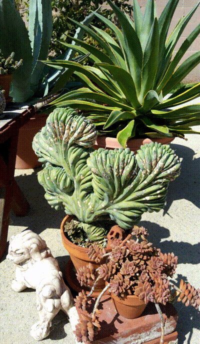

 
 
 

### Time Lapse Gallery
A tool for creating time-lapse photo sequences.

#### 1.2
* Implemented feature to convert photo-sequences to a GIF
* Created a feature to display weather data from the National Weather Service API
* Expanded test coverage, testing coroutines, repositories, datasources, etc.

#### 1.1
* Now handling camera directly with Camera2
* Implemented project tagging and improved scheduling by refactoring database schema
* Implemented gallery search
* Converted codebase from java to kotlin
* Converted to coroutines for asynchronous tasks
* Expanded test coverage

#### 1.0
Initial release allows for:
* Adding time-lapse projects and photos to projects
* Importing projects and photos into database from external file structure
* Notifications for basic daily or weekly scheduling
* Widget links to scheduled projects

### Installation 
Clone this repository and import into **Android Studio**:
`https://github.com/CEThompson/TimeLapseGallery.git`

### License
    Copyright 2020 Christopher Thompson

    Licensed under the Apache License, Version 2.0 (the "License");
    you may not use this file except in compliance with the License.
    You may obtain a copy of the License at

       http://www.apache.org/licenses/LICENSE-2.0

    Unless required by applicable law or agreed to in writing, software
    distributed under the License is distributed on an "AS IS" BASIS,
    WITHOUT WARRANTIES OR CONDITIONS OF ANY KIND, either express or implied.
    See the License for the specific language governing permissions and
    limitations under the License.

----
### Privacy Policy
Time Lapse Gallery is an open-source application. If you choose to use this application, then you agree to the collection and use of information described in this policy. 

##### Information Collection and Usage
This application uses Firebase Analytics and Crashlytics to collect information. The information collected regards interactions with the user interface and settings configurations such as the number of projects and photos added or deleted and the configuration of notifications, notification times, and playback speeds. Crashlytics is used to track any trending stability issues for the application.

##### Camera Data
This application requires a camera. The date time of photos taken are stored as EXIF data with the images, however this information is not tracked with analytics. This application does not tag photos with other metadata such as GPS location. Photos taken by this application are for use as you see fit.

#### The Purpose of Data Collection
This data collection is intended to improve the application so that it can better help you keep track of time-lapse photo projects. This application does not intend to track identifiable information about you or your photos, such as GPS data, and device identifications numbers. However, third party libraries may be collecting such information used to identify you. Privacy policies for those services are provided below:

* [Google Play Services Privacy Policy](https://policies.google.com/privacy?hl=en-US "Google Services Privacy Policy")

#### Your Rights
You have a right to your personal data. This application does not intend to collect that information beyond what is necessary to take great time-lapse pictures. This Privacy Policy may be updated and changes will be made available. If you have any questions or concerns please contact vwoomdev@gmail.com.

April 7th, 2020. 
